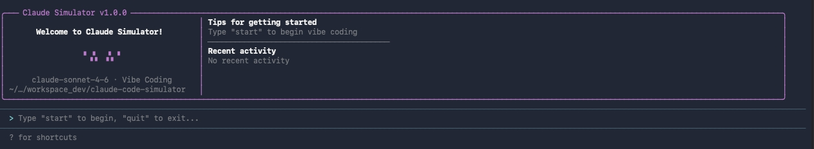

# Claude Simulator 🐱

[English](README.md) | [中文](README_CN.md)

**上班假装 vibe coding 的终极摸鱼神器！**

一个模拟 Claude Code 运行的 CLI 工具，生成随机工具调用和输出，营造"AI 辅助编程"的假象。让你在老板眼中是全公司最努力的开发者，实际上你只是在看漂亮的代码滚动。同事路过时纷纷感叹："哇，他正在用 AI 重构代码，太专业了！"



## 功能特点

- 🎭 **逼真界面** - 高仿 Claude Code 界面，响应式布局。真实到连你自己都信了，同事路过都要多看两眼
- 📊 **响应式布局** - 自动适配终端宽度（宽屏双栏模式，窄屏紧凑模式），摸鱼不分屏幕大小
- 🔧 **工具模拟** - 生成真实的 Read/Edit/Bash/Grep/Glob/Write 操作。老板问你忙啥？就说"AI 正在帮我重构核心模块"
- 🎨 **差异高亮** - 绿色背景显示新增代码，红色背景显示删除代码。"看，我在优化代码质量！"
- 🐱 **猫咪伴侣** - ASCII 艺术猫咪 logo（/\_/\ ( o.o ) > ^ <），氛围感拉满
- ⌨️ **交互命令** - 支持 start、stop、pause、resume 控制你的"开发进度"

## 安装

### 环境要求

- Node.js 18.0.0 或更高版本
- npm 或 yarn

### 快速开始

```bash
# 克隆仓库
git clone https://github.com/jetyou/claude-code-simulator.git
cd claude-code-simulator

# 安装依赖
npm install

# 运行模拟器
npm start
```

### 全局安装

```bash
# 全局安装
npm link

# 现在可以在任意目录运行
claude-simulator
```

## 使用方法

### 命令

| 命令 | 说明 |
|------|------|
| `start` | 开始氛围编程模拟 |
| `stop` | 暂停模拟 |
| `resume` | 暂停后继续 |
| `exit` | 退出程序 |
| `help` | 显示可用命令 |
| `clear` | 清空输出区域 |

### 快捷键

- `Ctrl+C` - 退出程序

## 截图展示

### 双栏模式（宽终端，≥70 列）

```
╭─── Claude Simulator v1.0.0 ──────────────────────────────────────────────╮
│                                           │ Tips for getting started     │
│       Welcome to Claude Simulator!        │ Type "start" to begin vibe c │
│                                           │ ──────────────────────────── │
│                 /\_/\                   │ Recent activity              │
│                ( o.o )                  │ No recent activity           │
│                                           │                              │
│      claude-sonnet-4-6 · Vibe Coding      │                              │
│ ~/…/workspace_dev/claude-code-simulator   │                              │
╰──────────────────────────────────────────────────────────────────────────╯
```

### 紧凑模式（窄终端，<70 列）

```
╭─── Claude Simulator v1.0.0 ──────────────────────────╮

              Welcome to Claude Simulator!

                     /\_/\  
                    ( o.o ) 
                     > ^ <

            claude-sonnet-4-6 · Vibe Coding
    ~/.openclaw/workspace_dev/claude-code-simulator

╰──────────────────────────────────────────────────────╯
```

## 示例会话

```
> start

✓ Read src/components/Header.tsx
  → 156 lines, React component

✓ Edit src/components/Header.tsx
  + const [data, setData] = useState(null);
  + const [loading, setLoading] = useState(false);
  - const [state, setState] = useState(null);
  → Added 2 lines, removed 1 line

✓ Bash npm run test
  → 47 tests passed, 0 failed

[Progress: Read 5 files | Modified 2 files | Ran 1 commands]
```

## 架构设计

基于 [Ink](https://github.com/vadimdemedes/ink)（React CLI 框架）构建：

```
src/
├── App.jsx                 # 主应用组件
├── components/
│   ├── Header.jsx          # 响应式头部（双栏/紧凑模式）
│   ├── Footer.jsx          # 状态栏，显示权限模式
│   ├── OutputArea.jsx      # 工具调用输出，支持差异渲染
│   ├── TextInput.jsx       # 用户输入框
│   └── Spinner.jsx         # 加载动画
├── engine/
│   └── SimulatorEngine.jsx # 核心调度逻辑
├── generators/
│   ├── ToolGenerator.jsx   # 随机工具调用生成
│   ├── CodeGenerator.jsx   # 假代码片段生成
│   └── CommentGenerator.jsx # 思考注释生成
└── hooks/
    └── useSimulatorState.jsx # 状态管理
```

## 开发

```bash
# 开发模式运行，支持热重载
npm run dev
```

## 技术栈

- **Ink** - React CLI 应用框架
- **React** - UI 框架
- **chalk** - 终端字符串样式
- **figures** - Unicode 符号
- **tsx** - TypeScript/JSX 运行时

## 许可证

[MIT License](LICENSE) © 2026

## 免责声明

这是一个模仿/娱乐工具，与 Anthropic 或 Claude Code 无关。它仅模拟编程活动的外观，仅供娱乐目的。

**请合理摸鱼！** 我们不对以下情况负责：
- 老板发现你对着终端傻笑却没有任何实际产出
- 你成了公司里"那个天天用 AI 写代码的人"
- 同事开始让你帮他们看真正的代码（这就尴尬了）
- 你忘了真正写代码是什么感觉

祝摸鱼愉快！🐱💻